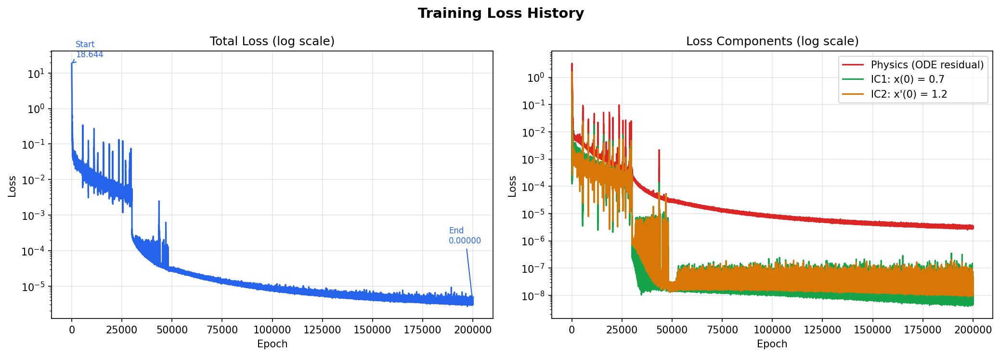
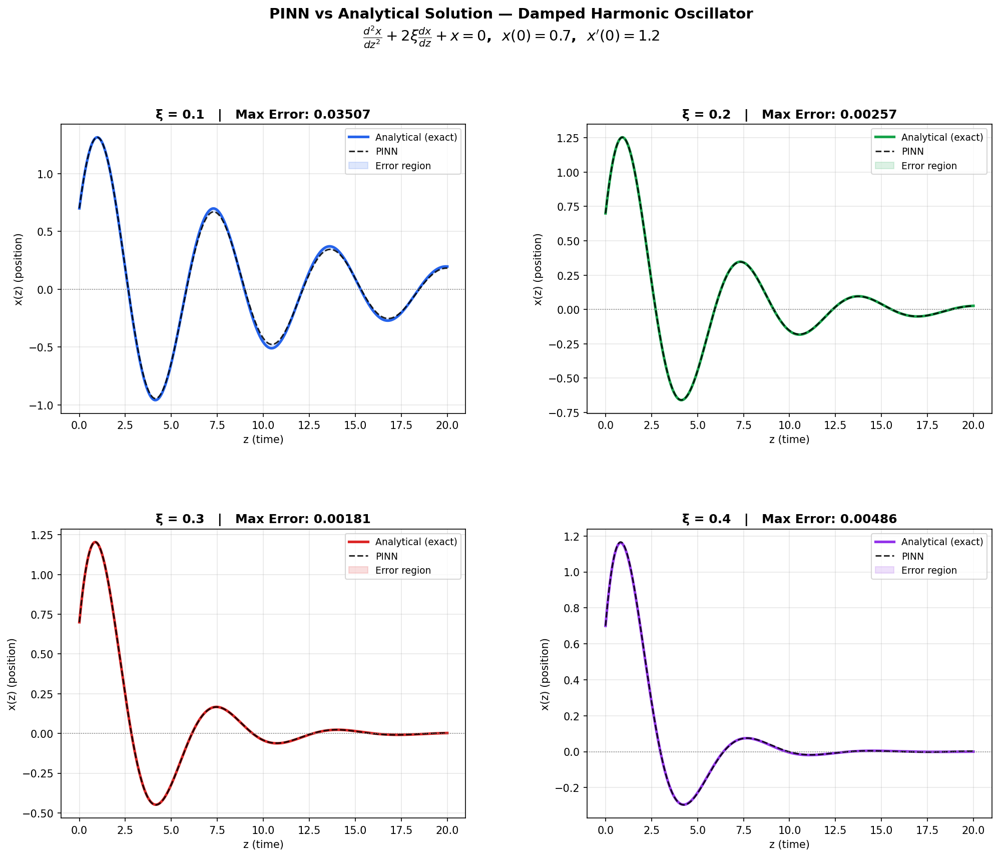
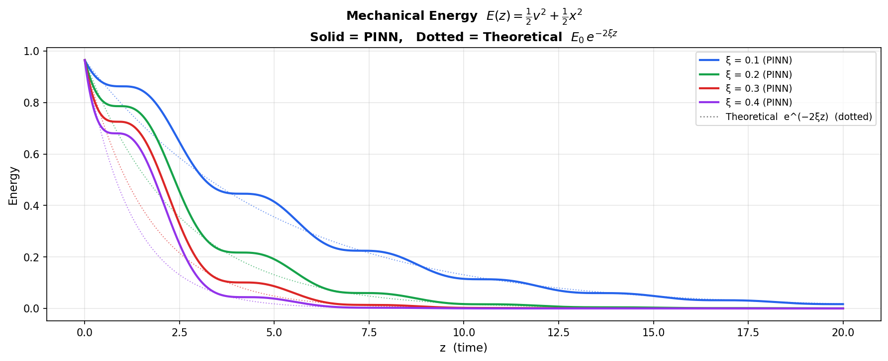
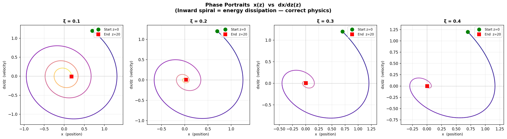

# PINN for the Damped Harmonic Oscillator

A **Physics-Informed Neural Network (PINN)** that solves the damped harmonic oscillator ODE using **SIREN-style sine activations**. Developed as a test solution for ML4SCI GSoC 2026 (GENIE5).

---

## The Problem

We solve the second-order ODE:

$$\frac{d^2x}{dz^2} + 2\xi\frac{dx}{dz} + x = 0$$

| Quantity | Range / Value |
|----------|----------------|
| **Domain** | $z \in [0, 20]$ |
| **Damping** | $\xi \in [0.1, 0.4]$ |
| **Initial conditions** | $x(0) = 0.7$, $\frac{dx}{dz}(0) = 1.2$ |

The solution is a damped sinusoid: $x(z) \propto e^{-\xi z}\bigl(A\cos(\omega_d z) + B\sin(\omega_d z)\bigr)$. The PINN learns this from the ODE residual and the initial conditions alone—no supervised data on $x(z)$.

---

## Why Sine (SIREN) Activations?

- The analytical solution is **sinusoidal in space** with an exponential envelope. A network built from **sine activations** can represent this structure naturally.
- **Tanh** would need many S-shaped pieces to approximate the same behavior, which is harder to train and less accurate.
- This implementation uses **SIREN-style weight initialization** and **input normalization** so that sine layers operate in a stable regime and training converges reliably.

---

## Features

- **Architecture:** 4 hidden layers × 128 neurons, sine activation, input normalization ($z$, $\xi$ mapped to $[-1,1]$).
- **Loss:** Physics (ODE residual) on 5000 collocation points + extra weighting on "hard" regions (late time, low damping); IC losses with weight 10.
- **Training:** Adam, LR $5\times10^{-4}$, MultiStepLR at 30k and 48k epochs, gradient clipping, 200k epochs.
- **Outputs:** Training curves, PINN vs analytical solution, energy decay, and phase portraits for $\xi = 0.1, 0.2, 0.3, 0.4$.

---

## Requirements

- Python 3.8+
- PyTorch
- NumPy
- Matplotlib

---

## Installation

```bash
git clone <your-repo-url>
cd <repo-name>
pip install torch numpy matplotlib
```

---

## Usage

From the repository root (so that the script can save plots and the model in the current directory):

```bash
python Vorlagen/GENIE5_PINN_sine_copy.py
```

Training runs on GPU if available. The script will:

1. Train the PINN for 200,000 epochs.
2. Save four figures and print an error summary.
3. Save the trained model as `pinn_damped_oscillator.pt`.

---

## Results

### 1. Training loss

Total loss and components (physics residual, IC1, IC2) in log scale.



---

### 2. PINN vs analytical solution

Comparison for $\xi = 0.1, 0.2, 0.3, 0.4$. Shaded area is the pointwise error.



---

### 3. Energy decay

Mechanical energy $E(z) = \frac{1}{2}v^2 + \frac{1}{2}x^2$ from the PINN (solid) vs theoretical $E_0\,e^{-2\xi z}$ (dotted).



---

### 4. Phase portraits

Phase plane $x$ vs $dx/dz$ for each $\xi$. Inward spiral reflects correct dissipative behavior.



---

## Output files

| File | Description |
|------|-------------|
| `plot_1_loss_curves.png` | Total and component losses vs epoch |
| `plot_2_pinn_vs_analytical.png` | PINN vs exact solution for four $\xi$ values |
| `plot_3_energy_decay.png` | Energy decay vs $z$ |
| `plot_4_phase_portrait.png` | Phase portraits for four $\xi$ values |
| `pinn_damped_oscillator.pt` | Trained PyTorch state dict |

---

## References

- SIREN: [Implicit Neural Representations with Periodic Activation Functions](https://arxiv.org/abs/2006.09661) (Sitzmann et al.).
- Physics-Informed Neural Networks: [Raissi et al.](https://www.sciencedirect.com/science/article/pii/S0021999118307125).

---

## License

MIT (or your preferred license).